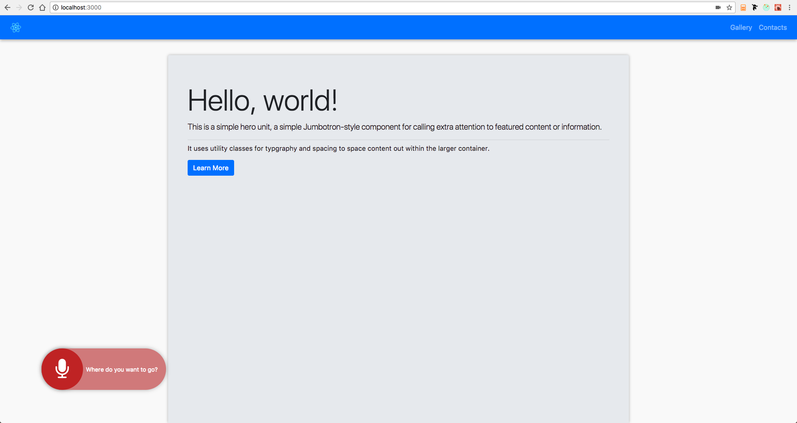
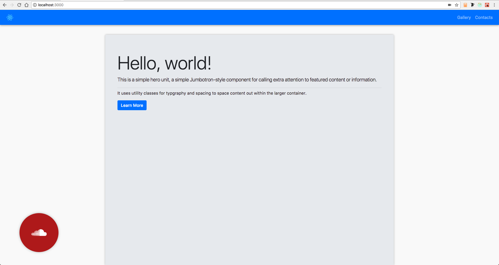
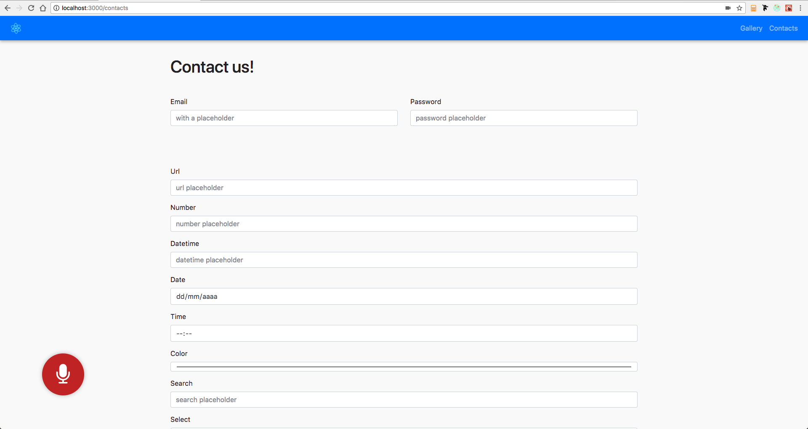
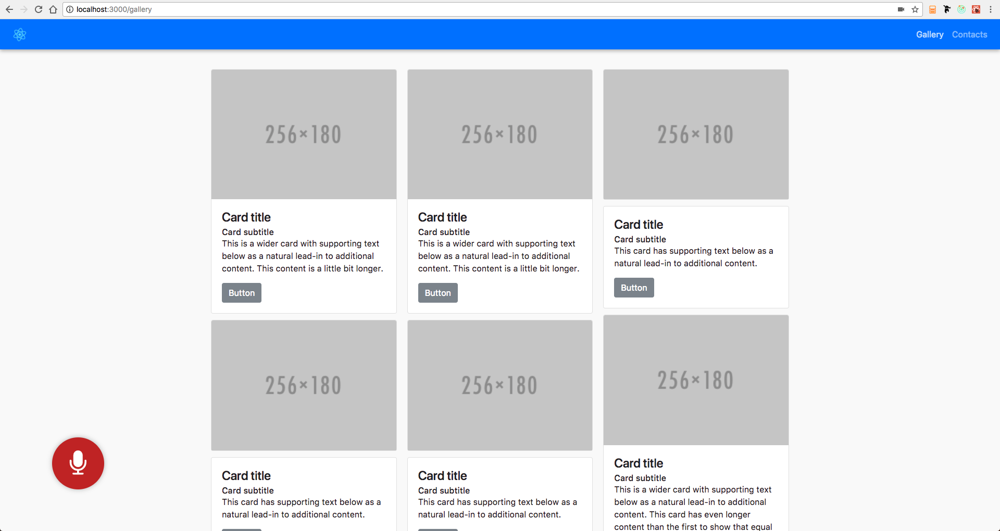
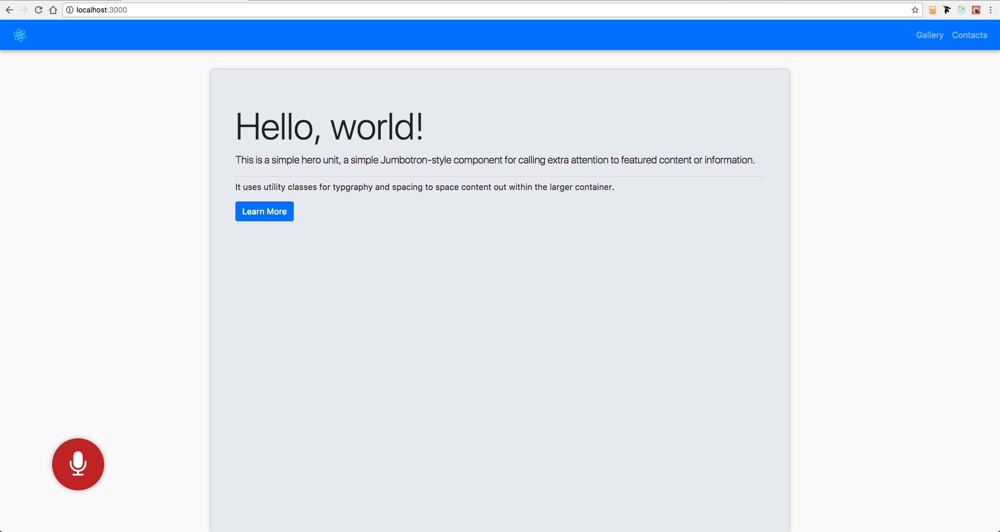
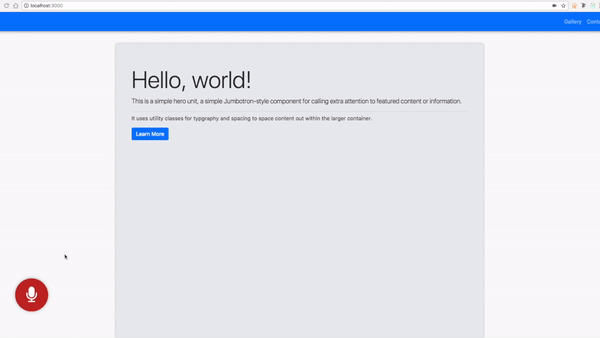

# React Audio Assistant

This a a demonstration project for the [react-audio-assistant](https://github.com/WebPaquitos/react-audio-assistant) package available on [npm](https://www.npmjs.com/package/react-audio-assistant).

This project uses the option to integrate with Redux, but you just have to import the option without redux to be able to use it just the same!
 
## Description
 
This demo uses the react-audio-assistant package to create an audio navigation experience in a demo website.

Notice that the routing that is done in this demo is managed by the project itself, the react-audio-assistant package does not know how to navigate around, or what library to use, that is up to you.

In this case [react-router-dom](https://reacttraining.com/react-router/web/guides/philosophy) (React router v4) is used to handle navigating the user around. 
 
## Instructions
 
`git clone https://github.com/WebPaquitos/audio-navigation-client.git`

`yarn` or `npm i`

`yarn start` or `npm start`

Now your project is running on [http://localhost:3000/](http://localhost:3000/)

You can now say destinations using three different destinations:
```
-> home
-> gallery
-> contacts
```
If the DialogFlow API does not recognize a destination, the package will ask again which destination you wanted to go again.

If you only say "Go", the package will ask "Where do you want to go?" and start listening again for your speech input.



Example of speech test sentences:



`"Navigate to contacts"`



`"Navigate to gallery"`



`"Go home"`



Example working:


 
## License

MIT
